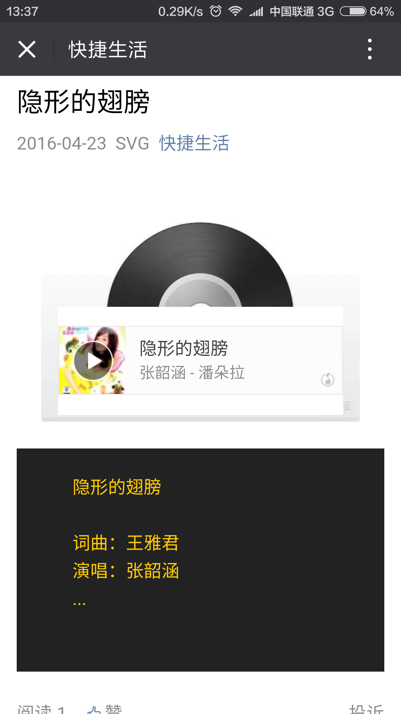

# Wechat-show-Lrc
微信公众号发送的文章里添加歌词样式滚动文字

功能使用：
```
$lrc = new lrc();
echo $result = $lrc->showLrc('隐形的翅膀.lrc');
```

把生成的字符串通过粘贴到公众号编辑器中就行了。如果不能正常展示，可以借助第三方工具进行复制粘贴；

###约束：
***1.lrc格式文件，支持通用的lrc格式:***
```
[00:26.89]每一次 都在徘徊孤单中坚强
[00:33.03]每一次 就算很受伤也不闪泪光
[00:39.81]我知道 我一直有双隐形的翅膀
[00:46.33]带我飞 飞过绝望
```
***2.也支持多时间格式:***
```
[00:35.50]Hear me as I'm calling out your name听到我呼唤你名字的时候
[00:41.50][01:31.00][02:17.50][02:40.50]Fire fly come back to me萤火虫飞回我身边
[00:43.50][01:33.50][02:20.50][02:44.00]Make the night as bring as day使夜晚像白天一样明亮 
[00:47.10][01:36.50][02:23.50][02:47.00]I'll be looking out for you你轻轻的告诉我
[00:50.00][01:39.50][02:26.50][02:49.70]Tell me that your lonely too告诉我你也很孤单 
```

效果图：


###输出SVG格式字符串：
```

<svg style="box-sizing: border-box;background:#222;fill:#fc0;text-align:center;" xmlns="http://www.w3.org/2000/svg" height="200" width="500">
<text x="50" y="250">3秒后开始歌词<animate repeatCount="1" dur="3s" to="0" from="250" attributeName="y" begin="0s" /></text>
<text x="50" y="250">2秒后开始歌词<animate repeatCount="1" dur="3s" to="0" from="250" attributeName="y" begin="1s" /></text>
<text x="50" y="250">1秒后开始歌词<animate repeatCount="1" dur="3s" to="0" from="250" attributeName="y" begin="2s" /></text>
<text x="50" y="250">隐形的翅膀<animate repeatCount="1" dur="20s" to="0" from="250" attributeName="y" begin="3s" /></text>
<text x="50" y="250">词曲：王雅君<animate repeatCount="1" dur="20s" to="0" from="250" attributeName="y" begin="7s" /></text>
<text x="50" y="250">演唱：张韶涵<animate repeatCount="1" dur="20s" to="0" from="250" attributeName="y" begin="9s" /></text>
<text x="50" y="250">...<animate repeatCount="1" dur="20s" to="0" from="250" attributeName="y" begin="11s" /></text>
<text x="50" y="250">每一次 都在徘徊孤单中坚强<animate repeatCount="1" dur="20s" to="0" from="250" attributeName="y" begin="27s" /></text>
<text x="50" y="250">每一次 就算很受伤也不闪泪光<animate repeatCount="1" dur="20s" to="0" from="250" attributeName="y" begin="34s" /></text>
...
<text x="50" y="250">留一个愿望 让自己想像<animate repeatCount="1" dur="20s" to="0" from="250" attributeName="y" begin="193s" /></text>
</svg>  
 
```
